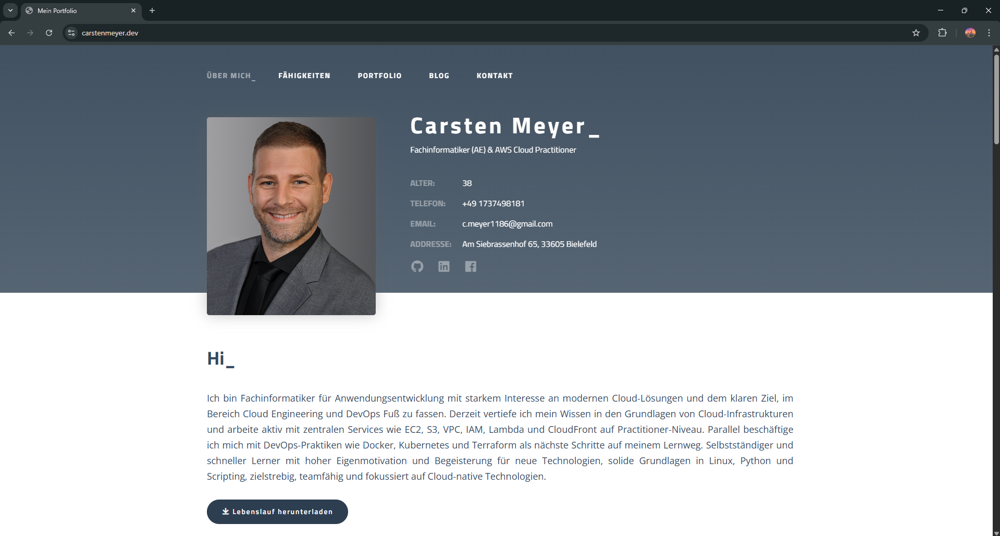
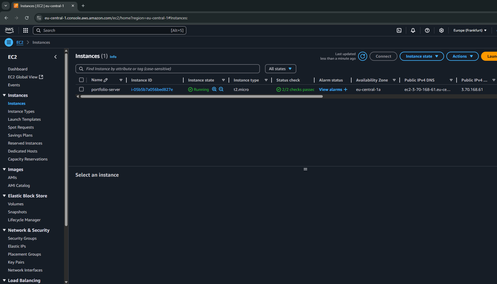
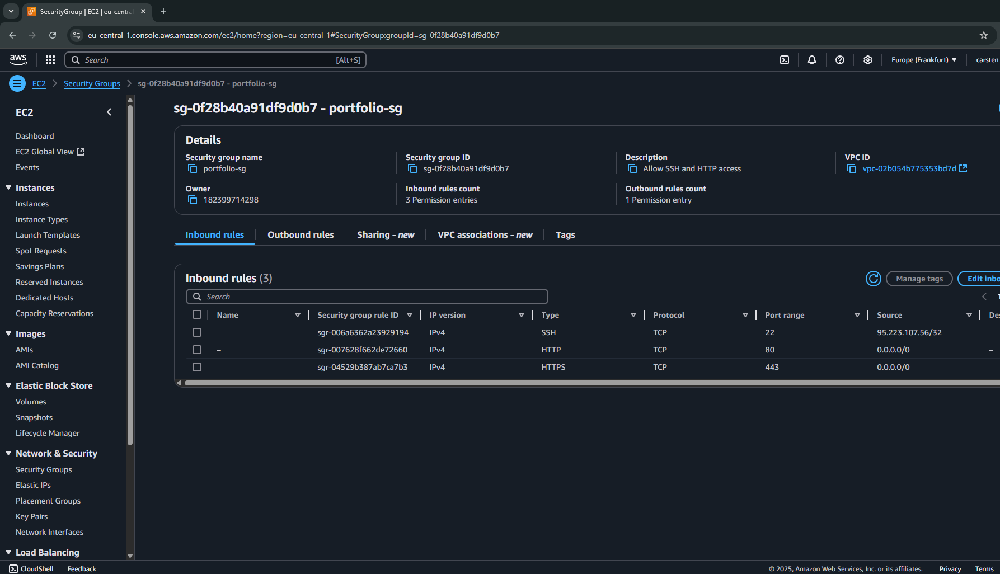

# AWS Portfolio Hosting – Phase 1 & 2

In diesem Repository dokumentiere ich die Bereitstellung meiner persönlichen Portfolio-Website über zwei unterschiedliche Hosting-Varianten auf AWS:  
**Phase 1 mit S3 + CloudFront**,  
**Phase 2 mit EC2 + Nginx + HTTPS**.

Ziel war es, Hosting, Deployment, Domainanbindung und Sicherheit praxisnah umzusetzen und dabei unterschiedliche AWS-Dienste zu kombinieren.

---

## Phase 1: Statische Website mit AWS S3 + CloudFront (Archiv-Version)

- Hosting über einen öffentlichen S3-Bucket mit aktivierter statischer Webhosting-Funktion
- HTML, CSS und statische Assets direkt im S3-Bucket gespeichert
- Zugriff ursprünglich über `carstenmeyer.dev` via CloudFront-Distribution
- Heute erreichbar über:  
  🔗 [`http://s3.carstenmeyer.dev`](http://s3.carstenmeyer.dev)

[Phase 1 – zum Quellcode](./phase1-s3-website)

---

## Phase 2: EC2 + Nginx + HTTPS (aktives Hosting)

- Live-Hosting der Website auf einer eigenen EC2-Instanz (Ubuntu Server)
- Manuelle Konfiguration von:
  - Nginx Webserver
  - Firewall-Ports (80/443)
  - Deployment via SSH/SCP
- Domainbindung mit `carstenmeyer.dev` über A-Records bei Namecheap
- Absicherung mit Let's Encrypt (Certbot) für HTTPS-Verschlüsselung

🔗 **Live-Demo (aktuelle Version):**  
[https://carstenmeyer.dev](https://carstenmeyer.dev)

[Phase 2 – zum Quellcode & Deployment](./phase2-ec2-website)

---

## Screenshots aus Phase 2

### Website live (HTTPS + eigene Domain)


### EC2-Instanz in AWS Console


### Security Group mit HTTP/HTTPS


---

## Projektstruktur

```bash
aws-portfolio-hosting/
├── phase1-s3-website/
│   ├── index.html
│   ├── style.css
│   └── README.md
├── phase2-ec2-website/
│   ├── index.html
│   ├── style.css
│   ├── screenshots/
│   └── README.md
└── README.md   ← diese Datei (Projektübersicht)