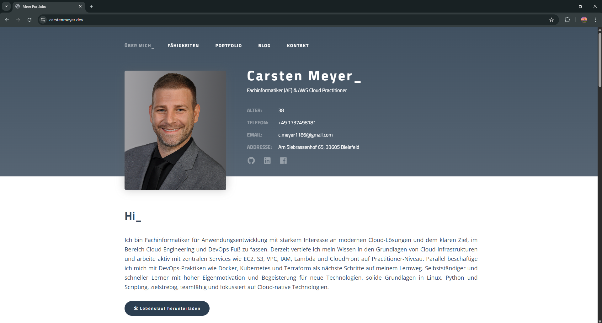
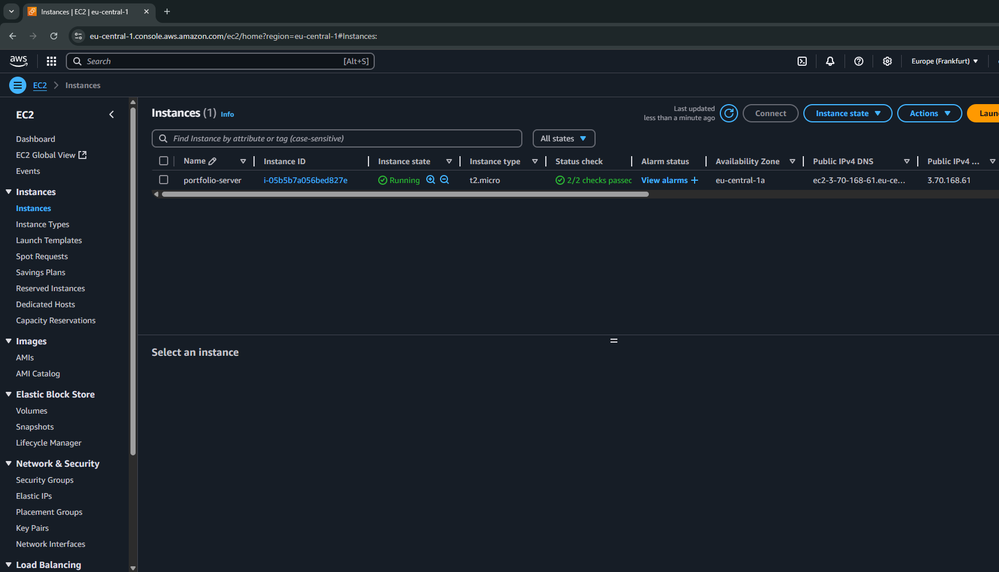
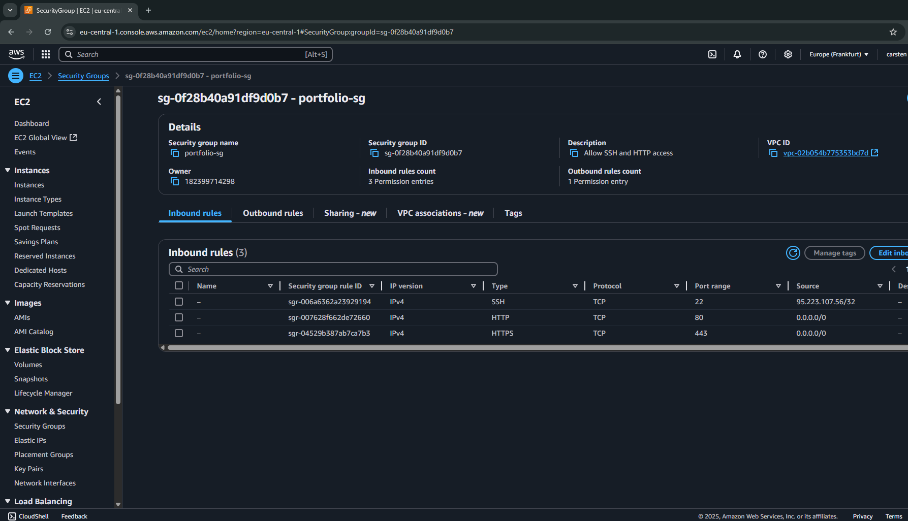

# Portfolio-Website Deployment (Phase 2)

Dieses Projekt beschreibt die Bereitstellung meiner persönlichen Portfolio-Website auf einer eigenen AWS-EC2-Instanz inklusive Domain-Anbindung und HTTPS-Absicherung.

## Tech-Stack

- **AWS EC2 (Ubuntu 22.04 LTS)**
- **Nginx**
- **Certbot / Let's Encrypt**
- **GitHub**
- **Namecheap Domain**
- **Linux (SSH, SCP, Dateirechte etc.)**

## Live-Demo

- 🔗 [https://carstenmeyer.dev](https://carstenmeyer.dev)

## Projektstruktur (lokal)

/phase2-ec2-website ├── index.html ├── style.css ├── images/ ├── screenshots ├── README.md

## Umsetzungsschritte

1. EC2-Instanz im AWS Free Tier gestartet (Ubuntu 22.04)
2. Nginx installiert und konfiguriert
3. Portfolio-Dateien via `scp` hochgeladen und Webroot gesetzt
4. Firewall-Ports (80, 443) in der Security Group geöffnet
5. Domain `carstenmeyer.dev` mit A-Records bei Namecheap verbunden
6. SSL-Zertifikat mit Let's Encrypt über Certbot eingerichtet
7. HTTPS-Redirect aktiviert
8. Projekt dokumentiert und auf GitHub veröffentlicht

## Screenshots

### Live-Website

### EC2-Instanz

### Security Group

## Optional: Subdomain-Archiv (Phase 1)

- 🔗 `http://s3.carstenmeyer.dev` *(ehemalige statische S3-Version, jetzt als Archiv)*

## Autor

**Carsten Meyer**  
[carstenmeyer.dev](https://carstenmeyer.dev)